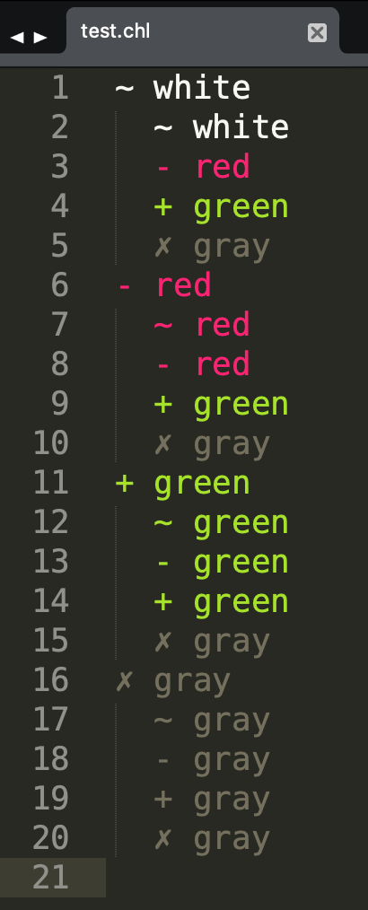

# Checklist Sublime Syntax

Sublime Text syntax highlighting for a nested checklist format.

## Installation

Copy the `Checklist/` directory into your [Sublime Text packages directory](https://www.sublimetext.com/docs/packages.html#locations).
You can navigate to this directory directly via Sublime's Browse Packages command from the command palette.

## Features

### Nested sections

### Comments

Lines starting with a `✗` are considered comments.
You can insert comments with Sublime's "Toggle Comment" command.
